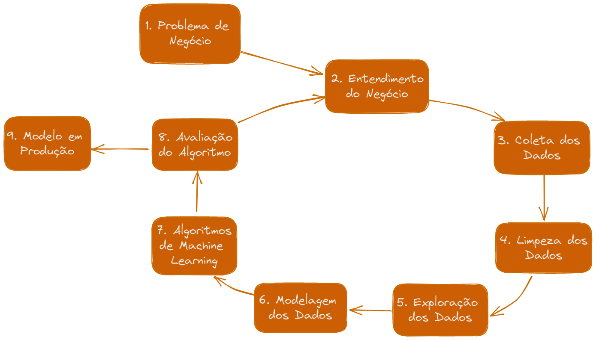
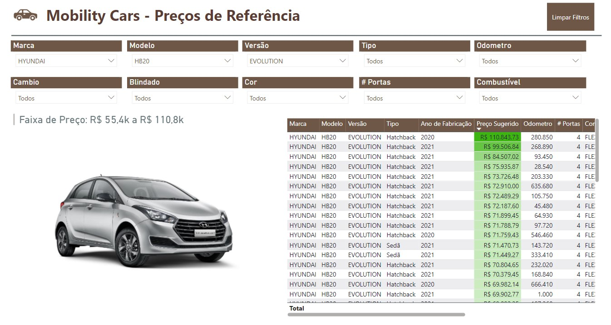
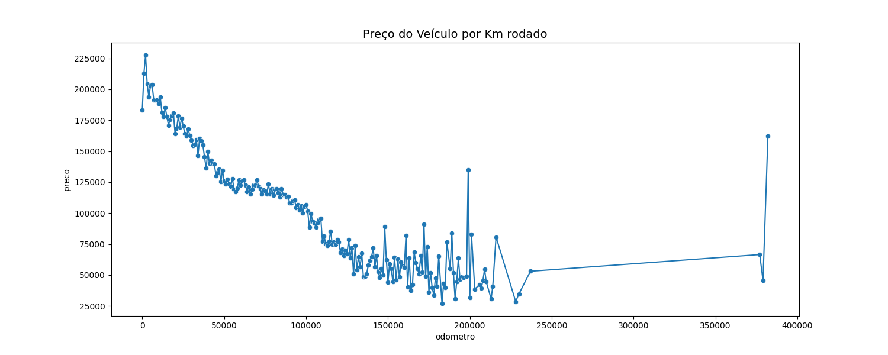
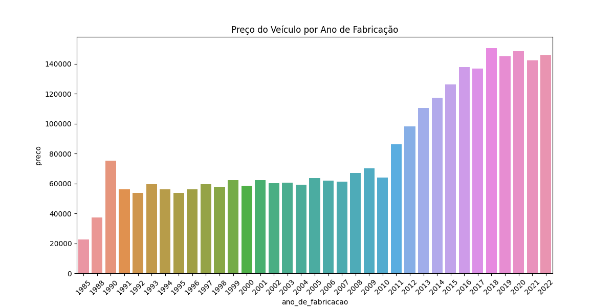

# Mobility-Cars

 

# 1. Problema de Negócio
  

A **Mobility Cars** é uma empresa tradicional do segmentos de compra e venda de veículos. Basicamente seu modelo de negócio consiste em comprar veículos usados no mercado e revende-los à outros motoristas. 

Com dificuldades de atingir suas metas de vendas, a Mobility Cars tem procurado estratégias para alavancar ainda mais sua revenda de carros, visando ampliar sua receita para então renovar sua frota de veículos. Para isso, ela decidiu **agir com maior inteligência no momento da revenda** dos carros

 

No mercado de Venda de Automóveis, a tabela FIPE é uma referência fundamental para todas as regociações envolvendo veículos usados, semi-novos e novos. Criada pela Fundação Instituto de Pesquisas Econômicas (FIPE), contempla o preço médio de veículos anunciados pelos vendedores no mercado nacional, porém, a tabela FIPE *não necessariamente reflete os preços finais de negociação dos veículos* e por isso **não costuma ser uma referência assertiva** para os valores praticados no mercado.

Para gerar mais inteligência no processo de vendas, a Mobility Cars busca uma forma mais assertiva, para prever o valor das negociações. Tendo uma referência de preço mais fidedigna, *baseada nos valores praticados no mercado*, será possível sair na frente nas negociações, se planejar financeiramente e ser mais rápido no processo venda.

Assim, a Mobility Cars contratou um time de Cientista de Dados para a construção de um modelo predição de valor de venda de automóveis.

# 2. Estratégia de Solução

Este projeto foi desenvolvido baseado na metodologia **CRISP-DM** (*Cross Industry Standard Process for Data Mining)* que consiste em um conjunto de etapas para a execução de um projeto de ciência de dados. A vantagem desse método é que possui uma metodologia cíclica, permitindo uma rápida entrega de valor para as áreas envolvidas.

Neste projeto, o CRISP-DM foi desenvolvido em 9 etapas que são ilustradas e detalhadas abaixo:

 

## 2.1. Questão de Negócio
Nesta etapa, nos deparamos com a questão de negócio que irá nortear todo o projeto. Neste casso, a questão é a situação da Mobility Cars que foi ilustrada no tópico anterior, onde a Mobility Cars ve a necessidade de aumentar as suas vendas. Para isso, enxerga a oportunidade de não ter como referência apenas a tabela FIPE que serve como referência para a venda de qualquer veículo novo e semi-novo.

## 2.2. Entendimento do Negócio
Com a questão de negócio em mente, precisamos entender: como podemos solucionar esse problema? Foi sugerido a construção de um modelo preditivo de preço de venda dos carros, mas será que essa realmente seria a melhor solução? Nesta etapa precisamos questionar as soluções em vista antes de iniciarmos o desenvolvimento. No caso deste projeto, entendemos que prever o preço de venda dos veículos seria uma vantagem competitiva muito importante para a Mobility Cars, que solucionaria a dor que foi trazida pela empresa, e ,por isso, essa é a solução que irá nortear todo o projeto

## 2.3. Coleta de Dados
Nesta etapa, serão coletados dados de diversas fontes para gerar um conjunto de dados robusto para o desenvolvimento do projeto.

## 2.4. Descrição dos Dados
Nesta fase, o principal objetivo é fazer a limpeza dos dados, o que envolveu principalmente:
  1. **Descrição dos Dados:** Foram checados os tipos das váriáveis disponíveis no conjunto e transformados para os tipos mais convenientes.
  2. **Filtragem dos Dados:** A conjunto de dados possui uma série de colunas com uma grande quantidade de valores nulos. Por entender que essas colunas não trariam valor significativo para o projeto e que demandariam muito esforço para seu tratamento, elas foram removidas do dataset.
        
## 2.5. Feature Engineering
Com o objetivo que facilitar a futura etapa de análise exploratória de dados, foram criadas uma série de features baseadas nas variáveis já presentes no dataset. Nessa etapa, a ideia é deixar as variáveis explicitas e de fácil acesso para as análises que serão feitas ao longo do projeto.
    
## 2.6. *Exploração dos Dados*
Para avaliar o comportamento das variáveis em relação à si mesmas e à variável resposta e sua distribuição, foi realizada uma exploração dos dados, focando em *análises univariadas* e em *análises bivariadas*, para entender como a variável em questão impacta na variável resposta.
    
## 2.7. *Modelagem dos dados*
Para a aplicação de algoritmos de Machine Learning é necessário transformar todas as variáveis em variáveis numéricas. Este dataset em particular possui uma grande quantidade de variáveis categoricas, portanto, foram aplicados técnicas de *Encoding*. Para as variáveis numéricas presentes, foram aplicadas técnicas de *Rescaling*.
    
Para a escolha das técnicas de Rescalings e Encoding, os critérios utilizados foram:
1. Robust Scaler: Para variáveis com muito outliers
2. Frequency Encode: Para variáveis onde se entende que sua frequencia está relacionada com a variável resposta
3. Target Encode: Para variáveis que possuiam muitas categorias
4. One Hot Encode: Para variáveis que representem uma ideia de estado
        
## 2.8. Feature Selection
Aqui, foram selecionadas as features mais relevantes para o modelo baseado em duas metodologias: Boruta e Importancia das Árvores.

## 2.9. *Algoritmos de Machine Learning*
Nesta fase foram testados 4 modelos de machine learning para o desenvolvimento da solução.

## 2.10. *Avaliação do Algoritmo*
Os algoritmos testados foram avaliados com base nas métricas de erro mais comuns em regressão (MAE, MAPE e RMSE) e então o melhor modelo foi adotado.

## 2.11. Hyperparameters Fine Tuning
Após a escolha do melhor modelo para o nosso projeto, nesta etapa foram selecionados os parametros para o modelo que maximizam os resultados.

## 2.12. *Modelo em Produção*
O modelo foi publicado em um ambiente cloud chamado [Render.com](http://Render.com) para que outras pessoas e serviços possam consultá-lo e utilizar suas predições para tomar melhores decisões. Logo após, foi realizada a previsão dos preços para todos os carros disponíveis na Mobility Cars e então os dados desses veículos bem como o seu valor de venda sugerido foram organizados em [um painel no Power BI](https://app.powerbi.com/groups/me/reports/0816ed1c-ff81-4f22-8b5c-d8058c221c43/ReportSection?experience=power-bi) para que os consultores de vendas possam acessar facilmente os modelos de interesse.

 

# 3. Top Data Insights

### H1. Carros com maior número de quilometros rodados são mais baratos

- VERDADEIRO
- Quanto mais quilometros rodados o carro tiver, mais barato isso será. Isso pode ser observado também sabendo que após 20 mil quilometros rodados o carro passa a ser considerado usado ao invés de semi novo, o que reduz bastante seu preço de mercado

 

### H2. Carro mais antigos tendem a ter um preço menor 

- VERDADEIRO
- Quanto mais antigo o carro seu preço, menor tende ser o seu preço. Mas isso ocorre até certo ponto:
        
    - Os motoristas parecem preferir carros fabricados até 10 anos atrás;
    - Carros com mais de 10 anos de existência tem um preço menor mas esse preço se estabiliza na faixa dos RS 60 mil;
    - Somente para carros com mais de 40 anos que esse valor parece cair novamente.

 

# 4. Modelos Aplicados

- Foram testados 4 modelos de machine learning para este problema:
    - Linear Regression
    - Lasso
    - Random Forest
    - XGBoost

# 5. Performance do Modelo

A avaliação dos modelos foi realizada através da técnica de **cross validation** que realizada diversas repartições no dataset para testar ao máximo a capacidade de generalização do modelo.
Abaixo é mostrado o resultado obtido para os 4 modelos, considerando as métricas de MAE, MAPE e RMSE:

| Modelo | MAE | MAPE | RMSE |
| ----- | ----- | ------ | ------- |
| Linear Model | 31847.356 +/- 537.373 | 0.255 +/- 0.004 | 50889.875 +/- 1367.78 |
| Lasso | 32330.313 +/- 681.823 | 0.26 +/- 0.004 | 51940.039 +/- 1422.971 |
| Random Forest | 26382.991 +/- 496.385 | 0.211 +/- 0.003 | 43010.375 +/- 2077.976 |
| XGBoost | 25955.946 +/- 474.954 | 0.207 +/- 0.003 | 42083.012 +/- 2006.905 |

O modelo **XGBoost**, por ter apresentado o melhor resultado em todas as métricas foi escolhido como modelo final para esse projeto.

# 6. Resultados de Negócio

Ao final do projeto, após os testes realizados, vemos que **o modelo desenvolvido foi capaz de reduzir o erro médio no preço de vendas dos veículos de comparado à uma solução mais genérica**. 

Para demonstrar isso, consideramos uma solução de referência que utiliza o *preço de venda média dos veículos por marca e modelo*. Isso foi feito para se aproximar ao máximo da tabela FIPE que, dentro do contexto de negócio, é a tabela de referência para a Mobility Cars.
Com base nisso, assumimos o preço de venda dos veículos como sendo a média histórica da marca e modelo de um conjunto de veículos, e assim obtivemos o seguinte resultado:

| Abordagem | MAE (Erro Médio)  |  MAPE (Erro Médio Percentual) |
| --------- | ------------------| ----------------------------- |
| Baseline  | R$ 38.168,78      |    34%                        |   

Logo após, realizamos as predições com o modelo xgboost para o mesmo conjunto de veículos utilizado na abordagem anterior, e obtivemos o seguinte resultado:

| Abordagem | MAE (Erro Médio)  |  MAPE (Erro Médio Percentual) |
| --------- | ------------------| ----------------------------- |
| Machine Learning  | R$ 20.842,60      |    16%                        |   

Com isso, vemos que o modelo **foi capaz de gerar uma previsão mais assertiva do preço de venda dos carros**, reduzindo esse erro em R$ 18.000 em médio por veículo ou reuzindo em 18% em médio o erro do preço estimado.

# 7. Conclusões

Após dos testes realizados, vemos que **o objetivo inicial do projeto foi alcançado**. A utilização do modelo de machine learning apresentou uma melhoria significativa na estimação do preço de venda dos carros em relação à tabela FIPE que considera o preço médio de venda dos veículos em todo o Brasil.

Com esse modelo implementado, a Mobility Cars, terá uma fonte mais precisa para a precificação dos seus veículos, criando um grande diferencial competitivo.

# 8. Lições Aprendidas

Neste projeto, lidei com situações novas e me deparei com alguns desafios como:

- Dataset com Labels raras: como o dataset possuia muitas variáveis categoricas, algumas das categorias possuiam frequencia muito baixa, o que foi um desafio para atingir uma boa performance.
- Muitas variáveis categóricas: isso dificultou um pouco o tratamento e o encodeing dos dados mas consegui contornar isso com funções e organização no código
- Webscrapping: para colocar o modelo em produção foi criado um painel no Power BI que continha imagens de todos os modelos de carros do conjunto de dados. Me desafiei a coletar essas imagens via webscrapping no google.

# 9. Proximos Passos

- Derivar mais features a partir da feature de "versão" que possui informações releventes.
- Criar novas features baseada no modelo de negócio como por exemplo, carros são consideramos seminovos quando possuem menos de 3 anos de uso e menos de 20 mil km rodados. Carros com mais de 20 km rodados são considerados usados, e etc.
- Utilizar a classe Pipelines do Sklearn para melhorar a organização do cógido e sua legibilidade
